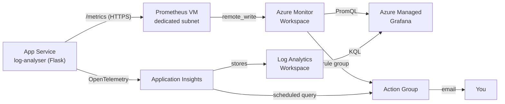

<div align="center">

<h1>
  
  &nbsp;Extended Monitoring &amp; Observability on Azure&nbsp;
  
</h1>


</div>

Two complementary monitoring signals for the same Flask API, combined in a single Grafana dashboard: HTTP traces through Application Insights, and custom business metrics through Azure Monitor managed service for Prometheus. Everything is provisioned with Terraform, nothing is self-hosted except the small VM that relays Prometheus metrics.

> This is my work write-up. The full assignment lives in [`docs/CONSIGNES.md`](docs/CONSIGNES.md).

## What this deploys

| Component | Azure resource | Purpose |
|---|---|---|
| App | Linux Web App (Python 3.11, Oryx build, no Docker) | Hosts the log-analyser Flask API |
| Traces | Application Insights + Log Analytics Workspace | HTTP telemetry, queried in KQL |
| Metrics store | Azure Monitor Workspace | Managed Prometheus storage, queried in PromQL |
| Metrics relay | Linux VM running Prometheus 3.12 | Scrapes `/metrics`, pushes via `remote_write` |
| Dashboard | Azure Managed Grafana | One dashboard, both data sources |
| Alerting | Prometheus rule group + scheduled query rule + Action Group | Business alert and technical alert, email delivery |

The app carries a dual instrumentation: `azure-monitor-opentelemetry` sends traces to Application Insights, while `prometheus-flask-exporter` exposes `/metrics` for Prometheus to scrape.

### App routes

| Route | Behaviour | What it exercises |
|---|---|---|
| `/` | 200, returns a greeting | Baseline traffic |
| `/health` | 200, `{"status": "ok"}` | Liveness check |
| `/error` | 500, logs at `ERROR` | Feeds `log_erreurs_total` and Application Insights failures |
| `/slow` | 200 after 3 s | Response-time panel |
| `/crash` | Raises, logs at `CRITICAL` | Unhandled exception path |

`log_erreurs_total` is a Prometheus `Counter` incremented by a `logging.Handler` attached to the Flask logger, so any log record at `ERROR` or above is counted wherever it is emitted, rather than counting by hand inside each route.

## Architecture



The Prometheus VM is the only piece introducing classic networking (VNet, dedicated subnet, NSG, public IP) into an otherwise fully managed stack. On AKS that layer disappears: the managed Prometheus addon handles scraping and ingestion inside the cluster.

## Tech stack

- **Terraform** `>= 1.9`, provider `azurerm ~> 4.0`, `azurerm` remote backend with one state key per team
- **Azure** managed services: App Service, Application Insights, Azure Monitor Workspace, Azure Managed Grafana
- **Prometheus** 3.12.0 on Ubuntu 22.04, authenticated to Azure with a system-assigned managed identity (3.50+ is required for an empty `client_id`)
- **Python** 3.11, Flask, `azure-monitor-opentelemetry`, `prometheus-flask-exporter`
- **Auth**: managed identity end to end, no secret in the Prometheus config

## Repository layout

```
terraform/
├── backend.tf         # azurerm remote state, one key per team
├── providers.tf       # azurerm ~> 4.0
├── variables.tf       # resource group, owner suffix, alert email, tags
├── main.tf            # App Service + App Insights + Monitor Workspace + Prometheus VM + roles + alerts
└── outputs.tf         # app URL, Grafana endpoint, DCE and DCR ids
app/
├── app.py             # Flask API, instrumented for App Insights + Prometheus
└── requirements.txt
function/              # HTTP-triggered Function App, kept from the previous lab
prometheus/
└── prometheus.yml     # scrape config + remote_write to the Azure Monitor Workspace
docs/
└── CONSIGNES.md       # full assignment
captures/              # Grafana dashboard and triggered alerts
simulate-incident.sh   # fires errors at the app to trigger both alerts
```

## Dashboard panels

| Panel | Data source | Query |
|---|---|---|
| Requests per minute | Azure Monitor Logs (KQL) | `requests \| summarize count() by bin(timestamp, 1m)` |
| Failure rate (%) | Azure Monitor Logs (KQL) | `requests \| summarize total=count(), failed=countif(success==false) by bin(timestamp,5m)` |
| Log error count | Azure Monitor Workspace (PromQL) | `log_erreurs_total` |
| App availability | Azure Monitor Workspace (PromQL) | `up{job="log-analyser-app"}` |

## Run it

```bash
cd terraform
terraform init      # see backend.tf before running this
terraform plan
terraform apply
```

Then deploy the application code and check both signals:

```bash
cd app
az webapp up --name app-monitoring-mpetit --resource-group mpetitRG --runtime "PYTHON:3.11"

curl https://app-monitoring-mpetit.azurewebsites.net/health
curl https://app-monitoring-mpetit.azurewebsites.net/metrics
```

Prometheus data lands in the Azure Monitor Workspace a few minutes after the VM starts. Check it in the portal under **Prometheus Explorer** with the query `log_erreurs_total`.

## Trigger the alerts

```bash
./simulate-incident.sh                     # defaults to app-monitoring-mpetit
./simulate-incident.sh autre-app-service   # or target another app
```

It fires 20 requests at `/error` and 10 at `/crash`, then prints the `log_erreurs_total` counter straight from `/metrics`. Both alerts should follow: the Prometheus rule group on the business metric, and the scheduled query rule on Application Insights failures.

## Gotchas worth knowing

- Role assignments take **up to 30 minutes** to propagate. A `403` in the Prometheus logs right after `terraform apply` is usually just propagation delay.
- `Monitoring Metrics Publisher` alone is not enough. Reading the auto-created Data Collection Endpoint and Rule also requires `Monitoring Reader`, otherwise the `az monitor data-collection ... show` calls fail with `AuthorizationFailed`.
- Never set a manual startup command on the App Service. It breaks Azure's Flask autodetection and produces `ModuleNotFoundError: No module named 'app'`.
- Prometheus 2.x rejects an empty `client_id` with a system-assigned identity. Use 3.50 or later.
- `log_erreurs_total` is a Counter, so it only ever grows. The assignment's `log_erreurs_total > 5` would fire once and never clear until the App Service restarts. The rule group uses `increase(log_erreurs_total[5m]) > 5` instead, which resolves on its own once errors stop.

## Outputs

- `app_service_url`: the Flask API HTTPS URL
- `grafana_endpoint`: the Azure Managed Grafana URL
- `dce_id`, `dcr_id`: ids needed to build the `remote_write` URL

## Cleanup

```bash
cd terraform
terraform destroy
# The resource group itself is kept, it is pre-created by the instructor
```

---

*DevSecOps Azure training, Simplon.*
