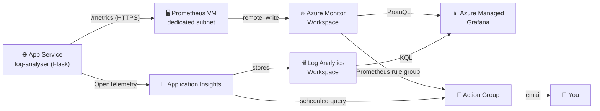

<h1 align="center">Extended Monitoring &amp; Observability, 100% Azure</h1>

<p align="center">Application Insights + Managed Prometheus + Managed Grafana</p>

<p align="center">
  
</p>

| | |
|---|---|
| ⏱️ **Duration** | 2 days (14 h) |
| 📶 **Level** | Intermediate, moving to advanced on the managed Prometheus part |
| 👥 **Group size** | 12 learners, 3 teams of 4 (single track, no A/B comparison this time) |
| 📋 **Prerequisites** | Terraform lab completed (modules, pre-assigned resource group, remote state). No Docker prerequisite: this lab deploys straight to Azure App Service, no containers. |

> ⚠️ **Heads-up.** Running "managed Prometheus against an app that is not in AKS" is a recent Azure integration with several classic traps: a specific Prometheus version is required, RBAC role assignments take about 30 minutes to propagate, and `remote_write` has to be wired by hand. It is not yet the "tick a box and it works" combo it becomes once the Kubernetes module is in place.
>
> **If your team is stuck on it at the end of Day 2**, you may fall back to an Application Insights dashboard alone for your presentation, with only the scheduled-query alert. That is not disqualifying, but document precisely where you got stuck and what you tried: it counts in the evaluation.

---

## 🧰 Before you start: the tools involved

**Monitoring** means continuously measuring the state of an application in production.

**Extended observability**, in this lab, means combining two complementary signals in a single dashboard:

- **Application traces**: every HTTP request, its duration, its status code, reported by Application Insights.
- **Custom business metrics**: the number of errors detected in your logs, reported through Prometheus.

**Application Insights** automatically collects your app's HTTP telemetry and stores it in a **Log Analytics Workspace**, queryable in **KQL**.

**Prometheus** is the open standard for application metrics. Your app exposes a `/metrics` endpoint; a Prometheus server scrapes it.

**Azure Monitor managed service for Prometheus** is Azure's managed version of Prometheus storage. Instead of keeping your metrics on a Prometheus server you have to maintain, you push them ("remote write") to an **Azure Monitor Workspace**, queryable in **PromQL**. Outside AKS you still need a small Prometheus server that scrapes your app and relays to that workspace: this is the most manual part of the lab.

**Azure Managed Grafana** plugs into both at once: an "Azure Monitor Logs" data source (KQL, for Application Insights) and an "Azure Monitor Workspace" data source (PromQL, for managed Prometheus). One dashboard, two query languages, two signals.

---

## 🏢 Scenario

You are still the DevSecOps team at **NexaCloud**. The log-analyser application (a Flask API) is now deployed on **Azure App Service** through Terraform, reusing exactly the pattern from the Terraform lab (`app-service` module, pre-assigned resource group, remote state). The enterprise customer is raising the bar:

> *"We want to see both whether the application responds properly (response time, HTTP errors) AND track our own business indicators (number of errors in the logs), all in a single dashboard, without hosting anything ourselves."*

### 👥 Teams

Three teams of 4, one Azure environment per team.

| Team | Size | Azure Resource Group |
|---|---|---|
| 🟦 Team 1 | 4 | `rg-monitoring-groupe1` |
| 🟩 Team 2 | 4 | `rg-monitoring-groupe2` |
| 🟧 Team 3 | 4 | `rg-monitoring-groupe3` |

The resource group is pre-created by the instructor (same principle as the Terraform lab and the previous monitoring lab: you stay confined to your own RG and cannot touch the other two teams' resources).

Inside a team, split into two pairs working in parallel on the same repo and the same shared Terraform state:

- 👨‍💻 **Pair 1**: App Service + Application Insights (Day 1, morning)
- 🧑‍💻 **Pair 2**: Azure Monitor Workspace + Prometheus VM (Day 1, afternoon)

All four of you regroup on Day 2 to build the shared Grafana dashboard and the alerts.

---

## 🗺️ Target architecture

### 🧱 Starting point (before Application Insights)


This is the state inherited from the previous Terraform lab: four public, independent PaaS services (Storage Account, App Service, Function App, Container Instance) plus a two-subnet VNet wired to nothing, a separate networking exercise. That VNet is not thrown away: in step 4 it will host a third, dedicated subnet for the Prometheus VM.

### ➕ What this lab adds


The diagram deliberately shows both states.

**Before** (Day 1, steps 1 to 3): App Service and Application Insights form a 100% PaaS chain, no VNet, no subnet, nothing to network.

**After** (end of the lab): the Prometheus VM is the **only resource introducing classic networking** (VNet, dedicated subnet, NSG, public IP) into an otherwise fully managed architecture. That contrast is exactly what motivates the closing question in step 9: on AKS this networking layer disappears entirely, since the addon handles everything inside the cluster.

### 🔀 Full flow



---

## 📁 Expected deliverable structure

```
TP-Monitoring-Etendu/
├── terraform/
│   ├── backend.tf
│   ├── providers.tf
│   ├── variables.tf
│   ├── main.tf              <- App Service + App Insights + Monitor Workspace + Prometheus VM + roles + alerts
│   └── outputs.tf
├── app/                      <- copy of the log-analyser app, instrumented (App Insights + prometheus-flask-exporter)
├── prometheus/prometheus.yml <- remote_write config (produced in step 5)
└── captures/                 <- Grafana dashboard, triggered alerts
```

---

## 🚀 Day 1: Azure deployment and dual instrumentation

### 🔑 Step 0: get your team's access (15 min)

Ask the instructor for:

1. Your resource group name: `rg-monitoring-groupe1`, `2` or `3`
2. The shared Terraform state key: `monitoring-etendu-groupe<N>.tfstate`
3. Confirmation of your Contributor role on that RG

**Why the RG is pre-created rather than created by you:** in a subscription shared by the whole cohort, you only get Contributor rights scoped to your own RG. You cannot touch the other two teams' resources, exactly as in the previous Terraform lab.

**One Git repo per team.** All four members work on the **same repo** and the **same Terraform state**, not one repo per person. In `terraform/backend.tf`:

```hcl
terraform {
  backend "azurerm" {
    resource_group_name  = "rg-tfstate-formation"
    storage_account_name = "ststateformationdevops"
    container_name       = "tfstate"
    key                  = "monitoring-etendu-groupe1.tfstate" # replace with YOUR key, given by the instructor
  }
}
```

> ⚠️ The storage account and the container are **shared by the whole cohort**; only the `key` isolates your team's state from the other two. Double-check it before your first `terraform init`: if you reuse another team's key by mistake, you risk overwriting or locking their state.

**Coordinating Pair 1 and Pair 2 on a shared state.** The `azurerm` backend locks the state during every `terraform apply`. If both pairs run an apply at the same time, the second one blocks waiting for the lock (it does not crash, it waits). In practice: one pair applies at a time, `git push` once done, the other pair does a `git pull` before taking over. That is why the lab is split chronologically (Pair 1 in the morning, Pair 2 in the afternoon) rather than truly simultaneously.

### ☁️ Step 1: deploy the app on Azure App Service with Terraform (1 h 30, Pair 1)

You already did this in the Terraform lab, so do it again, this time without ready-made code. In `terraform/main.tf`:

```hcl
# data "azurerm_resource_group" "rg" {
#   name = ???   # rg-monitoring-${var.groupe}
# }

# resource "azurerm_service_plan" "plan" {
#   name                = ???
#   resource_group_name = ???
#   location            = ???
#   os_type             = "Linux"
#   sku_name            = "B1"
# }

# resource "azurerm_linux_web_app" "app" {
#   name                = ???
#   resource_group_name = ???
#   location            = ???
#   service_plan_id     = ???
#
#   site_config {
#     application_stack {
#       python_version = "3.11"   # same runtime as the Terraform lab
#     }
#   }
#
#   app_settings = {
#     "SCM_DO_BUILD_DURING_DEPLOYMENT" = "true"
#   }
# }
```

> 💡 Same structure as the `app-service` module from the Terraform lab (`azurerm_service_plan` + `azurerm_linux_web_app`). If you get stuck, reuse that module directly rather than starting from scratch.

Documentation: https://registry.terraform.io/providers/hashicorp/azurerm/latest/docs/resources/linux_web_app

No Docker here: App Service builds the Python app straight from your sources (Oryx buildpack), as in the Terraform lab. Run `terraform apply`, then deploy the code:

```bash
cd app
az webapp up --name app-monitoring-groupe1 --resource-group rg-monitoring-groupe1 --runtime "PYTHON:3.11"
```

> ⚠️ **Never set a manual startup command** (`gunicorn --bind=0.0.0.0:8000 app:app` or equivalent), even if the app returns 404/503 right after deployment. It breaks Azure's automatic Flask detection and causes `ModuleNotFoundError: No module named 'app'`. If nothing responds, wait for the build to finish instead: `az webapp log tail --name <app> --resource-group <rg>`.

Check it:

```bash
curl https://app-monitoring-groupe1.azurewebsites.net/health
```

### 🧪 Step 2: dual instrumentation of the app (1 h, Pair 1)

In `app.py`, both instrumentations coexist without interfering: one sends to Application Insights, the other exposes `/metrics` for Prometheus.

```python
from azure.monitor.opentelemetry import configure_azure_monitor
from prometheus_flask_exporter import PrometheusMetrics
import os

configure_azure_monitor(
    connection_string=os.environ["APPLICATIONINSIGHTS_CONNECTION_STRING"]
)

metrics = PrometheusMetrics(app)

erreurs_gauge = metrics.gauge(
    'log_erreurs_total', "Number of errors detected in server.log"
)

@erreurs_gauge.set_function
def compter_erreurs():
    result = parse_logs(config["api"]["log_file"])
    return result["error_count"] + result["critical_count"]
```

```bash
pip install azure-monitor-opentelemetry prometheus-flask-exporter
```

Add `APPLICATIONINSIGHTS_CONNECTION_STRING` to the Terraform `app_settings` (value obtained in step 3), redeploy, then verify:

```bash
curl https://app-monitoring-groupe1.azurewebsites.net/metrics
```

### 🔭 Step 3: Application Insights (45 min, Pair 1)

Add to the same `main.tf`:

```hcl
resource "azurerm_log_analytics_workspace" "law" {
  name                = "law-monitoring-${var.groupe}"
  resource_group_name = data.azurerm_resource_group.rg.name
  location            = data.azurerm_resource_group.rg.location
  sku                 = "PerGB2018"
  retention_in_days   = 30
}

resource "azurerm_application_insights" "appi" {
  name                = "appi-monitoring-${var.groupe}"
  resource_group_name = data.azurerm_resource_group.rg.name
  location            = data.azurerm_resource_group.rg.location
  workspace_id        = azurerm_log_analytics_workspace.law.id
  application_type    = "web"
}
```

**Why a Log Analytics Workspace first:** Application Insights no longer runs in isolated "classic" mode since 2018. It must be attached to a workspace, which is the real data store queried in KQL.

Run `terraform apply`, get the connection string (`terraform output -raw app_insights_connection_string`), inject it into the App Service `app_settings`, redeploy.

---

### 🖥️ Step 4: Azure Monitor Workspace + Prometheus VM (2 h 30, Pair 2)

**Why a VM and not a simple container:** managed-identity authentication for Prometheus `remote_write` is officially documented and validated by Microsoft for VMs/VMSS and AKS, but not (yet) for Container Apps. So we use a small Linux VM, which stays within skills you already have (Linux, cloud-init) from earlier in the course.

#### 🔥 4.1 The managed Prometheus workspace

```hcl
resource "azurerm_monitor_workspace" "amw" {
  name                = "amw-monitoring-${var.groupe}"
  resource_group_name = data.azurerm_resource_group.rg.name
  location            = data.azurerm_resource_group.rg.location
}
```

Creating this workspace **automatically creates**, in the background, a dedicated Data Collection Endpoint and Data Collection Rule. You do not have to create them yourself.

#### 🐧 4.2 The VM hosting Prometheus

```hcl
resource "azurerm_linux_virtual_machine" "prometheus_vm" {
  name                = "vm-prometheus-${var.groupe}"
  resource_group_name = data.azurerm_resource_group.rg.name
  location            = data.azurerm_resource_group.rg.location
  size                = "Standard_D2s_v3" # not Standard_B1s: unavailable on this training subscription
  admin_username      = "azureuser"

  identity {
    type = "SystemAssigned"
  }

  admin_ssh_key {
    username   = "azureuser"
    public_key = file("~/.ssh/id_rsa.pub")
  }

  network_interface_ids = [azurerm_network_interface.nic.id]

  os_disk {
    caching              = "ReadWrite"
    storage_account_type = "Standard_LRS"
  }

  source_image_reference {
    publisher = "Canonical"
    offer     = "0001-com-ubuntu-server-jammy"
    sku       = "22_04-lts"
    version   = "latest"
  }

  custom_data = base64encode(<<-EOF
    #!/bin/bash
    # Version 3.12.0, NOT 2.53.0: a SYSTEM-assigned managed identity (our case, empty
    # client_id in prometheus.yml at step 5) requires Prometheus 3.50+ per Microsoft docs.
    # On an older version Prometheus fails at startup with "must provide an Azure Managed
    # Identity client_id in the Azure AD config".
    apt-get update
    apt-get install -y wget
    useradd --no-create-home --shell /bin/false prometheus
    wget https://github.com/prometheus/prometheus/releases/download/v3.12.0/prometheus-3.12.0.linux-amd64.tar.gz
    tar xvf prometheus-3.12.0.linux-amd64.tar.gz
    cp prometheus-3.12.0.linux-amd64/prometheus /usr/local/bin/
    mkdir -p /etc/prometheus
  EOF
  )
}
```

> You also need networking (VNet, subnet, public IP or Bastion, NSG). Reuse the network module you already wrote in the Terraform lab, allowing port 9090 (the Prometheus UI) from your IP only.

#### 🔐 4.3 The role letting the VM write to the workspace

```hcl
resource "azurerm_role_assignment" "prometheus_publisher" {
  scope                = azurerm_monitor_workspace.amw.default_data_collection_rule_id
  role_definition_name = "Monitoring Metrics Publisher"
  principal_id         = azurerm_linux_virtual_machine.prometheus_vm.identity[0].principal_id
}
```

> **Plan for the delay:** a role assignment takes up to 30 minutes to propagate. A `403` in the Prometheus logs right after the apply is not necessarily a config mistake, so wait before re-checking everything.

> **This role alone is not enough for step 5.** `Monitoring Metrics Publisher` lets the VM *write* metrics (remote_write), but not *read* the Data Collection Endpoint/Rule resources themselves. Without the roles below, the `az monitor data-collection ... show` commands in the next step fail with `AuthorizationFailed` even when the previous role is correctly in place.

```hcl
resource "azurerm_role_assignment" "prometheus_dce_reader" {
  scope                = azurerm_monitor_workspace.amw.default_data_collection_endpoint_id
  role_definition_name = "Monitoring Reader"
  principal_id         = azurerm_linux_virtual_machine.prometheus_vm.identity[0].principal_id
}

resource "azurerm_role_assignment" "prometheus_dcr_reader" {
  scope                = azurerm_monitor_workspace.amw.default_data_collection_rule_id
  role_definition_name = "Monitoring Reader"
  principal_id         = azurerm_linux_virtual_machine.prometheus_vm.identity[0].principal_id
}
```

Run `terraform apply`, then SSH into the VM to finish the configuration.

### 🔌 Step 5: configure remote_write (1 h, Pair 2)

Collect the two required values. Their exact field names can vary slightly across CLI versions, so inspect the JSON output if needed.

```bash
# Metrics ingestion endpoint of the auto-created Data Collection Endpoint.
# Mind the space: "data-collection endpoint" (two words), not "data-collection-endpoint"
# (single hyphenated word), which az cli rejects with "not recognized by the system".
DCE_ID=$(terraform output -raw dce_id)
az monitor data-collection endpoint show --ids "$DCE_ID" --query metricsIngestionEndpoint -o tsv

# Immutable ID of the auto-created Data Collection Rule (same note: "data-collection rule")
DCR_ID=$(terraform output -raw dcr_id)
az monitor data-collection rule show --ids "$DCR_ID" --query immutableId -o tsv

# Client ID of the VM's managed identity
az vm identity show --name vm-prometheus-groupe1 --resource-group rg-monitoring-groupe1 --query principalId -o tsv
```

On the VM, create `/etc/prometheus/prometheus.yml`:

```yaml
global:
  scrape_interval: 30s

scrape_configs:
  - job_name: 'log-analyser-app'
    scheme: https
    static_configs:
      - targets: ['app-monitoring-groupe1.azurewebsites.net']

remote_write:
  - url: "<DCE-endpoint>/dataCollectionRules/<DCR-immutable-id>/streams/Microsoft-PrometheusMetrics/api/v1/write?api-version=2023-04-24"
    azuread:
      cloud: 'AzurePublic'
      managed_identity:
        client_id: ""   # empty = system-assigned identity, as required here
```

Start Prometheus:

```bash
sudo /usr/local/bin/prometheus --config.file=/etc/prometheus/prometheus.yml &
```

**Validation:** in the Azure portal, open your Azure Monitor Workspace, go to **Prometheus Explorer** and query `log_erreurs_total`. Your data should show up (allow a few minutes).

---

## 📈 Day 2: unified dashboard, alerts, presentation

### 📊 Step 6: Azure Managed Grafana and the unified dashboard (2 h, whole team)

```hcl
resource "azurerm_dashboard_grafana" "grafana" {
  name                  = "grafana-monitoring-${var.groupe}"
  resource_group_name   = data.azurerm_resource_group.rg.name
  location              = data.azurerm_resource_group.rg.location
  grafana_major_version = "12" # required (no default value); if "12" is rejected when you run
                               # the lab, the terraform apply error message lists the valid
                               # versions, which change often

  identity {
    type = "SystemAssigned"
  }
}

resource "azurerm_role_assignment" "grafana_monitoring_reader" {
  scope                = data.azurerm_resource_group.rg.id
  role_definition_name = "Monitoring Reader"
  principal_id         = azurerm_dashboard_grafana.grafana.identity[0].principal_id
}
```

In Grafana (`terraform output grafana_endpoint`), add **two Azure Monitor data sources**. A single "Azure Monitor" resource actually handles both modes (Logs and Prometheus), so pick the right mode per panel. Build a dashboard with at least 4 panels:

| Panel | Source | Query |
|---|---|---|
| 📈 Requests per minute | Azure Monitor Logs (KQL) | `requests \| summarize count() by bin(timestamp, 1m)` |
| ❌ Failure rate (%) | Azure Monitor Logs (KQL) | `requests \| summarize total=count(), failed=countif(success==false) by bin(timestamp,5m) \| extend taux=100.0*failed/total` |
| 🐞 Log error count (business metric) | Azure Monitor Workspace (PromQL) | `log_erreurs_total` |
| 💚 App availability (technical metric) | Azure Monitor Workspace (PromQL) | `up{job="log-analyser-app"}` |

### 🚨 Step 7: two complementary alerts (1 h 30)

**Alert 1, on the Prometheus metric (PromQL):**

```hcl
resource "azurerm_monitor_action_group" "ag" {
  name                = "ag-monitoring-${var.groupe}"
  resource_group_name = data.azurerm_resource_group.rg.name
  short_name          = "alertmonit"

  email_receiver {
    name          = "formateur"
    email_address = "formateur@simplon.co"
  }
}

resource "azurerm_monitor_alert_prometheus_rule_group" "alerte_erreurs" {
  name                = "alerte-erreurs-${var.groupe}"
  resource_group_name = data.azurerm_resource_group.rg.name
  location            = data.azurerm_resource_group.rg.location
  cluster_name        = azurerm_monitor_workspace.amw.name
  scopes              = [azurerm_monitor_workspace.amw.id]

  rule {
    enabled    = true
    expression = "log_erreurs_total > 5"
    severity   = 2

    action {
      action_group_id = azurerm_monitor_action_group.ag.id
    }
  }
}
```

**Alert 2, on Application Insights (scheduled query, already covered):**

```hcl
resource "azurerm_monitor_scheduled_query_rules_alert_v2" "alerte_taux_erreur" {
  name                 = "alerte-taux-erreur-${var.groupe}"
  resource_group_name  = data.azurerm_resource_group.rg.name
  location             = data.azurerm_resource_group.rg.location
  evaluation_frequency = "PT5M"
  window_duration      = "PT5M"
  scopes               = [azurerm_application_insights.appi.id]
  severity             = 2

  criteria {
    query                   = "requests | where success == false"
    time_aggregation_method = "Count"
    threshold               = 5
    operator                = "GreaterThan"
  }

  action {
    action_groups = [azurerm_monitor_action_group.ag.id]
  }
}
```

**Why two alerts instead of one:** this is the heart of "extended monitoring". A business incident (many errors in the logs) and a technical incident (the API responding badly) are not detected the same way nor in the same place. In your presentation you will compare the two trigger delays.

### 💥 Step 8: simulate an incident (45 min)

```bash
for i in {1..30}; do curl -s https://app-monitoring-groupe1.azurewebsites.net/api/route-inexistante; done
```

**Deliverable:** a screenshot of both alerts in the triggered state.

### 🎤 Step 9: presentation (1 h, whole cohort)

Each team presents for 10 minutes: its unified dashboard, a demo of both alerts, and an answer to this question:

> *"What took you the most time, Application Insights or managed Prometheus, and why do you think most of that difference will disappear once your apps run on AKS?"*

> Hint to prepare: on AKS, managed Prometheus is enabled with a single cluster option (`az aks enable-addons`), with no VM and no manual remote_write to configure. You have just done by hand what an addon will do for you in a few weeks.

---

## ✅ Evaluation criteria

| Criterion | Points |
|---|---|
| ☁️ App deployed on App Service via Terraform, without Docker | 2 pts |
| 🧪 Working dual instrumentation (App Insights + `/metrics`) | 3 pts |
| 🔌 Azure Monitor Workspace + working remote_write (data visible in Prometheus Explorer) | 4 pts |
| 📊 Unified Grafana dashboard, at least 4 panels, 2 data sources | 4 pts |
| 🚨 Both alerts configured and their triggering demonstrated | 5 pts |
| 🎤 Clear presentation, reasoned answer on the link with AKS | 2 pts |
| 🧹 Cleanup (`terraform destroy`) | 1 pt |
| **Total** | **21 pts**, scaled to 20 (in case of a justified and documented blocker on `remote_write`, see the fallback in the introduction) |

---

## 🧹 Cleanup at the end of the lab

```bash
terraform destroy -var="groupe=groupe1"
```

> Do not delete the resource group itself: it was created by the instructor and is reused later. Azure Managed Grafana, Application Insights and the VM are billed per usage, so leave nothing running after the lab.
